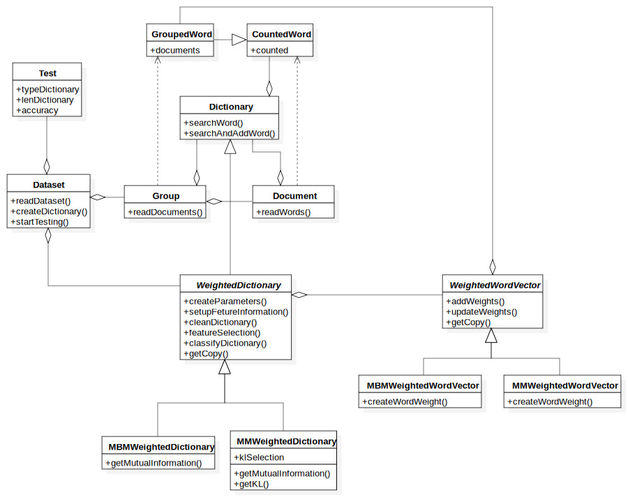

# Text Categorization

Progetto per il corso di AI per l'università degli studi di Firenze.

Si vuole ottenere i risultati di [(McCallum & Nigam, 1998)](/documents/text-categorization)

## Dipendenze

Le seguenti dipendenze sono necessarie per il funzionamento del programma
- Sklearn
- Matplotlib
- PrettyTable
- Progressbar

```bash
pip install sklearn matplotlib progressbar PrettyTable
```

## Struttura

La struttra delle classi è la seguente



## Comandi

Il software prevede 4 comandi principali, più eventuali argomenti posizionali che possono sia opzionali che obbligatori a seconda del comando.

### import-data

Questo comando serve per importare il dataset nella directory 'data' del progetto, può anche essere aggiunta manualmente, semplicemnte compiando il dataset nella directory assicurandosi che i dati siano divisi in 'train' e 'test'.

Argomenti posizionali:
- -p | --path: Serve per indicare il percorso alla cartella contenente il dataset. (Obbligatorio)
- -s | --split [ratio]: Indica che il dataset deve essere diviso in 'train' e 'test', può anche essere indicato il rapporto di suddivisione. Default: 0.2 (80:20)
- -n | --name [name]: Imposta il nome da dare al dataset 

### start-training

Questo comando inizia a leggere il dataset, e crea il dizionario con i suoi parametri.

Argomenti posizionali:
- -n | --name [name]: Il nome del dataset selezionato. (Obbligatorio)
- -sw | --stop-words [words ...]: Indica quali sono le stop words da rimuovere. Queste parole non verranno aggiunte al dizionario.
- -he | --headers [headers ...]: Se il dataset ha degli headers che devono essere rimossi per non comprometere il risultato dei test, vengo indicati qui l'inizio del header. (Esempio in news é stato indicato come headers: "Newsgroups:")
- -fr | --fast-reading: Imposta questo parametro per avere una lettura più veloce del dataset, questo in pratica rimuove la fase di tokenization e le parole saranno divise medianti gli spazi, questo comporta un maggior numero di parole trovate durante la lettura.

### start-testing

Effettua i test di un dataset scelto.

Argomenti posizionali:
- -n | --name [name]: Il nome del dataset selezionato. (Obbligatorio)
- -fl | --feature-lenght [V ...]: Imposta il numero massimo di parole del dizionario per la feature selection, indicare con -1 se si vogliono usare tutte le parole.
- -kl | --kl-feature: Imposta come feature selection la versione KL al posto della informazione mutuale. Questo avviene solo per il modello multinomiale.

### plot-result

Mostra i risultati del test precedente.

Argomenti posizionali:
- -n | --name [name]: Il nome del dataset selezionato. (Obbligatorio)

### show-datasets

Mostra i datasets disponibili.

## Risultati

Data la natura casuale della suddivisione dei file in Train e Test, i risultati ottenuti possono variare, anche se in maniera lieve.I risultati qui riportati sono ottenuti tramite i dataset reperibili nella sezione dataset.

Sono stati analizzati i 4 datasets, 


### Newsgroup

Il dataset è formato da 19 gruppi, e sono stati utilizzati tutti. Come headers è stato impostato "Newsgroups:".

Multi-variate Bernulli supera il multinomial in dizionari relativamente piu' piccoli, ma al aumentare delle parole il multinomial ha una performance superiore.
Ma in entrambi casi ci sa un miglioramento in termini di accuratezza al amuentare del numero di parole considerate. Arrivando fino al 85% di accuratezza per quanto riguarda il multinomial, e 80% per il multi-variate. In questo caso il modello multinomiale con il KL ottiene un maggior incremento nell'accuratezza rispetto all'informazione mutuale.

#### Mutual information


#### KL feature-selection


### Webkb

Il dataset Webkb è formato da 7 gruppi, ma ne sono state utilizzate solo 4: student, faculty, staff e course.

Qui possiamo notare come il multi-variate già da subito ha un accuratezza molto elevata, con un massimo a 100 parole, e tiene un andamento costante.
Nel caso multinomiale se si usa l'informazione mutuale si ha un accuratezza minore rispetto al multi-variate nel caso dei dizionari piccoli, e va a diminuire man mano che le parole del dizionario aumentano. Anche qui con la versione KL si ottengono dei risultati migliori.

#### Mutual information


#### KL feature-selection


### Sector 48


### Film

Il dataset è formato solo da due gruppi (nel dataset e presente anche una terza categoria che è stata rimossa), positivo e negativo.

Multi-variate Bernulli si comporta già bene con poche parole nel dizionario.
Il Multivariate ottiene delle prestazioni analoge al multi-variate bernulli, ma con delle prestazioni leggermente inferiori


## Datasets:

News: http://www.cs.cmu.edu/afs/cs/project/theo-11/www/naive-bayes/20_newsgroups.tar.gz

Sector: http://archive.ics.uci.edu/ml/machine-learning-databases/00239/corpus.zip

Webkb: http://www.cs.cmu.edu/afs/cs.cmu.edu/project/theo-20/www/data/webkb-data.gtar.gz

Film: http://ai.stanford.edu/~amaas/data/sentiment/ 
